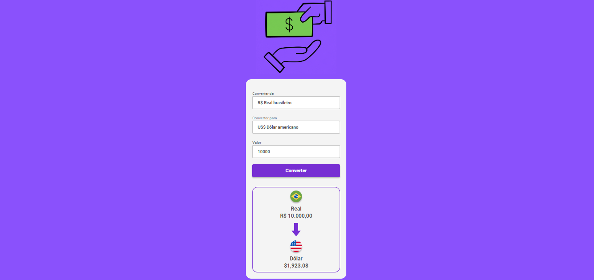

# Convert-money

Esse projeto é um conversor, para telas desktop, de valores para determinadas moedas diferentes. As tecnologias utilizadas foram: HTML5, CSS3 e JavaScript. O projeto ainda está em fases de aprimoramento.

 
